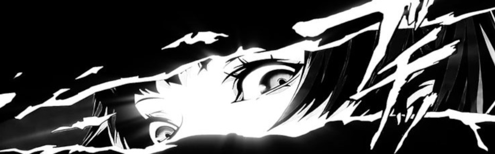

<!-- Banner: replace assets/banner.png with any image (png/jpg/gif). It stretches to the page width and keeps its aspect ratio. -->

  

  
  

## 👨‍💻 About Me

I'm **Theo** (aka **zeldocto**), head moderator and maintainer of the **Super Mario Sunshine individual level leaderboard** and an active member of the SMS speedrunning community.

I build tools that make the game easier to practice, route, and time, from load removers to ghost and skin archives for the Moonshine practice mod.

---

## 📂 Repositories

| Repo | Description |
| --- | --- |
| [**zeldocto.github.io**](https://github.com/zeldocto/zeldocto.github.io) | Personal website + various speedrunning tools |
| [**delfino-ghosts**](https://github.com/zeldocto/delfino-ghosts) | A place to upload your Moonshine ghosts |
| [**moonshine-customs**](https://github.com/zeldocto/moonshine-customs) | Skin website for Moonshine skins |
| [**LoadAnalyzer**](https://github.com/zeldocto/LoadAnalyzer) | Frame-accurate SMS load time remover that detects black loading screens in recorded runs |
| [**gct-generator**](https://github.com/zeldocto/gct-generator) | Gecko code practice file generator for Super Mario Sunshine |

---

## 📊 Battle Stats

  

  

---

### 👀 Total Visitors

  

